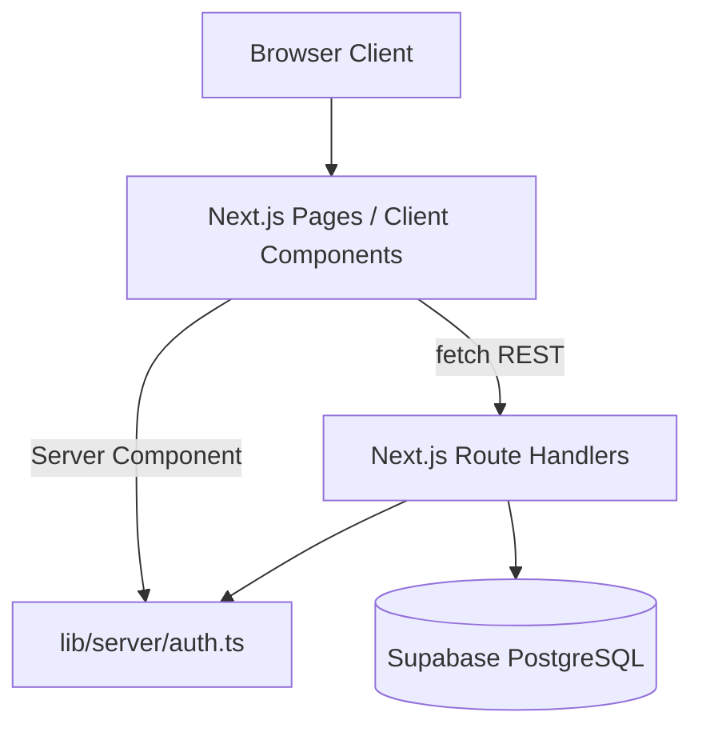

# EventSync — Technical Requirements Document (TRD)

## Tech Stack

| Layer | Technology |
|-------|------------|
| Framework | Next.js 16 (App Router) |
| UI library | React 19 |
| Language | TypeScript 5 |
| Styling | Tailwind CSS 4 |
| UI primitives | Radix UI (`@radix-ui/react-*`) |
| Icons | `lucide-react` |
| Animation | `motion/react` |
| Forms (admin panels) | Native forms + `react-hook-form` available in dependencies |
| Notifications | `sonner` (dependency present; limited direct usage in core flows) |
| Database / BaaS | Supabase (`@supabase/supabase-js`) |
| Auth session | Custom HMAC-signed HttpOnly cookie (`lib/server/auth.ts`) |
| Node crypto | `node:crypto` for HMAC session signing |

**Declared but not used in application code:** `express`, `react-router-dom`.

## Project Structure

```
eventsync/
├── app/                          # Next.js App Router pages and API routes
│   ├── api/
│   │   ├── admin/events/         # Protected event mutations
│   │   ├── admin/opportunities/  # Protected opportunity mutations
│   │   ├── auth/                 # login, logout, signup, session
│   │   ├── events/               # Public event reads
│   │   ├── opportunities/        # Public opportunity reads
│   │   ├── config/supabase/      # Supabase config exposure route
│   │   └── health/               # Health check
│   ├── admin/                    # Admin dashboard (server-protected)
│   ├── auth/                     # Login, signup pages
│   ├── events/                   # Events list and detail
│   ├── opportunity/              # Opportunities list and detail
│   ├── layout.tsx                # Root layout with Header/Footer
│   ├── page.tsx                  # Homepage
│   └── globals.css               # Theme tokens and base styles
├── lib/
│   ├── server/
│   │   ├── auth.ts               # Session cookie helpers
│   │   ├── supabase.ts           # Supabase client factory
│   │   └── validation.ts         # Request field validation helpers
│   ├── session.ts                # AdminSession type
│   ├── event-categories.ts       # Category constants and normalization
│   └── utils.ts                  # Shared utilities (e.g. `cn`)
├── src/components/
│   ├── admin/                    # Admin dashboard panels
│   ├── layout/                   # Header, Footer
│   └── ui/                       # shadcn-style Radix UI components
├── public/                       # Static assets
├── docs/                         # Project documentation
├── package.json
├── tsconfig.json
└── next.config.ts
```

Path aliases:

- `@/*` → project root
- `@/components/*` → `src/components/*`

## System Architecture



- **Monolithic Next.js app:** UI and API live in the same deployment.
- **Data access:** API route handlers instantiate a Supabase client with anon credentials.
- **Auth boundary:** Public read routes are open; admin mutation routes call `requireAdminApiSession()`.
- **Page protection:** `/admin` uses server-side `getAdminSession()` and `redirect()`.

## Frontend Architecture

- **Rendering mix:**
  - Root layout and `/admin` use Server Components.
  - Discovery pages, auth pages, and admin panels are Client Components (`'use client'`).
- **Data fetching:** Client components call internal REST APIs via `fetch`.
- **Routing:** Next.js App Router file-based routes only (not `react-router-dom`).
- **Composition:**
  - Shared `Header` and `Footer` in root layout.
  - Admin UI split into sidebar + panel components (`AdminDashboard`, `CreateEventPanel`, etc.).
- **Filtering/search:** Implemented in browser with `useMemo` over fetched arrays.
- **Animation:** `motion/react` for page sections, cards, and admin transitions.

## Backend Architecture

- **API style:** RESTful JSON route handlers under `app/api/**/route.ts`.
- **HTTP methods:**
  - `GET` — public reads (`/api/events`, `/api/opportunities`, detail routes, `/api/health`, `/api/auth/session`)
  - `POST` — auth, admin create
  - `PUT` — admin update
  - `DELETE` — admin delete, logout
- **Validation:** `lib/server/validation.ts` trims strings and builds required-field errors.
- **Error handling:** JSON `{ error: string }` with appropriate HTTP status codes; `console.error` on server failures.
- **Coordinator lifecycle:** On event update, existing coordinators are deleted then re-inserted. On event delete, a coordinator cleanup retry path exists for FK constraint failures.

## Authentication & Authorization

### Session model

- Cookie name: `eventsync_admin_session`
- Payload: JSON `AdminSession` (`id`, `email`, `name`, `role`, `loginAt`, `expiresAt`)
- Signing: HMAC-SHA256 with `SESSION_SECRET` (fallback env keys supported)
- Duration: 8 hours
- Cookie flags: `httpOnly`, `sameSite: 'lax'`, `secure` in production

### Login flow

1. `POST /api/auth/login` looks up user by email in `users`.
2. Password matched against `password`, `password_hash`, or `passwd` column (plaintext compare today).
3. Role must be `admin` or `superadmin`.
4. Session cookie is set on success.

### Authorization checks

- `getAdminSession()` — read/verify cookie for pages.
- `requireAdminApiSession()` — returns session or `401`/`403`/`500` JSON for APIs.
- Signup (`POST /api/auth/signup`) is public and inserts into `users` without granting admin session.

## API Design Standards

- **Base path:** `/api`
- **Response format:** JSON objects with domain keys (`events`, `data`, `opportunity`, `session`, `error`)
- **Status codes:**
  - `200` — success reads/updates
  - `201` — created resources
  - `400` — validation / malformed body
  - `401` — missing or invalid session
  - `403` — non-admin user
  - `404` — missing resource (`PGRST116`)
  - `409` — duplicate signup email
  - `500` — server/database errors
  - `503` — health degradation
- **Admin routes:** `/api/admin/events`, `/api/admin/events/[id]`, `/api/admin/opportunities`, `/api/admin/opportunities/[id]`
- **Canonical opportunity routes:** plural `/api/opportunities` (no duplicate aliases)

### Environment variables

| Variable | Purpose |
|----------|---------|
| `SUPABASE_URL` or `NEXT_PUBLIC_SUPABASE_URL` | Supabase project URL |
| `SUPABASE_ANON_KEY` or `NEXT_PUBLIC_SUPABASE_ANON_KEY` | Supabase anon key |
| `SESSION_SECRET` | Session signing (fallbacks: `EVENTSYNC_SESSION_SECRET`, `AUTH_SESSION_SECRET`, `JWT_SECRET`) |

## State Management

- **Approach:** Local React state (`useState`, `useEffect`, `useMemo`) per page/component.
- **Session in header:** Fetched from `/api/auth/session` on mount and when pathname changes.
- **No global store:** Project not Supported for Redux, Zustand, React Context data stores, or TanStack Query.

## Caching Strategy

Project not Supported.

- No Redis, in-memory cache layer, or CDN cache rules in the codebase.
- Client fetches use default browser caching; header session fetch uses `cache: 'no-store'`.
- Supabase queries are uncached server-side per request.

## Security Considerations

| Area | Current state |
|------|----------------|
| Admin session | Signed HttpOnly cookie with expiry |
| Password storage | Plaintext comparison — needs hardening |
| RBAC | Admin/superadmin only for protected routes |
| CSRF | SameSite=Lax cookie; no explicit CSRF token |
| RLS | Not configured in repository |
| Service role key | Not used; anon key handles writes from API routes |
| Input validation | Required-field checks on admin mutations |
| Error leakage | Login may expose Supabase error codes in development-style responses |

## Performance Strategy

- Client-side filtering avoids extra API round trips for search/filter changes.
- Homepage and list pages load full collections — suitable for small/medium datasets.
- `Promise.all` used when fetching event + coordinators in parallel.
- Event delete uses direct delete with coordinator cleanup fallback.
- **Not implemented:** pagination, infinite scroll, backend indexes documentation, image optimization pipeline beyond Next defaults.

## Logging & Monitoring

- **Logging:** `console.error` in API route catch blocks and Supabase failure paths.
- **Health check:** `/api/health` returns `status`, `timestamp`, and `supabase` connectivity field.
- **Monitoring / APM / structured logging:** Project not Supported.

## Deployment Strategy

- **Build:** `npm run build`
- **Start:** `npm run start`
- **Dev:** `npm run dev`
- **Lint:** `npm run lint`
- **Hosting model:** Standard Node-compatible Next.js deployment (e.g. Vercel-compatible); no CI/CD, Docker, or infrastructure-as-code files are present in the repository.
- **Database:** External Supabase project configured via environment variables.
