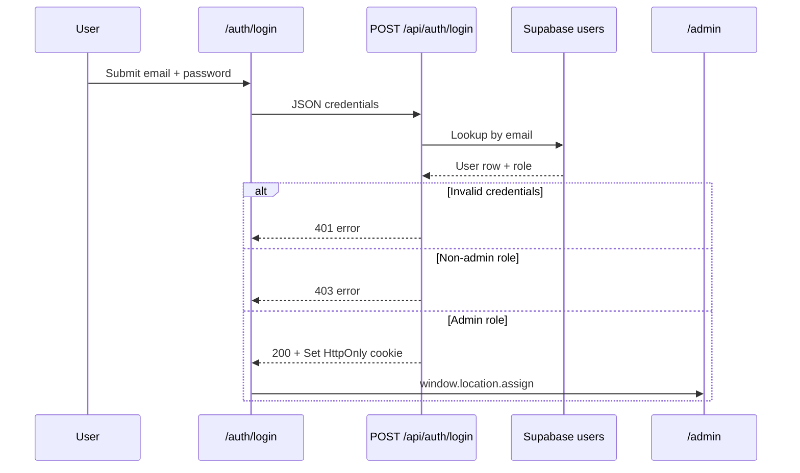
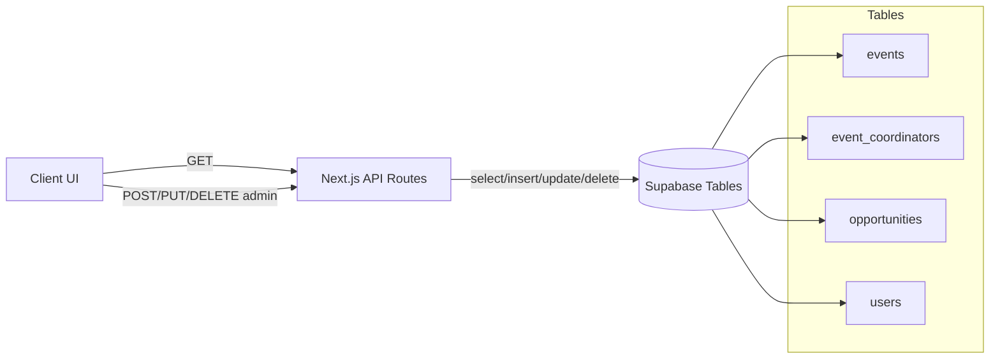

# EventSync — Application Flow

## Application Overview

EventSync is a single Next.js application with two primary experiences:

1. **Public discovery** — anyone can browse the homepage, events, and opportunities.
2. **Admin management** — authenticated admins manage content from `/admin`.

All dynamic data flows through Next.js API routes, which read/write Supabase tables.

## Navigation Structure

```
Header (global)
├── Home              → /
├── Events            → /events
├── Opportunities     → /opportunity
├── Login             → /auth/login        (when logged out)
├── Dashboard         → /admin             (when admin session active)
└── Logout            → POST /api/auth/logout → redirect /

Footer (global)
├── Explore links     → /events, /opportunity, /auth/login, /admin
└── Account links     → /auth/login, /auth/signup, /admin

Admin sidebar
├── Create Event      → panel switch
├── Manage Events     → panel switch
├── Create Opportunity→ panel switch
└── Manage Opportunities → panel switch
```

**Detail routes:**

- `/events/[id]` — event detail
- `/opportunity/[id]` — opportunity detail

**Auth routes:**

- `/auth/login`
- `/auth/signup`
- `/auth` — auth index page exists

## Authentication Flow



### Signup flow

1. User opens `/auth/signup`.
2. Submits name, email, password, confirm password.
3. `POST /api/auth/signup` checks for duplicate email.
4. Inserts row into `users`.
5. Returns success message; user is **not** auto-logged into admin dashboard.

### Session check flow

1. `Header` calls `GET /api/auth/session` on load and route change.
2. If valid admin cookie exists, show Dashboard + Logout.
3. If not, show Login link.

### Logout flow

1. User clicks Logout.
2. `POST /api/auth/logout` clears session cookie.
3. Browser redirects to `/`.

### Admin page guard

1. User navigates to `/admin`.
2. Server runs `getAdminSession()`.
3. If no session → `redirect('/auth/login')`.
4. If session exists → render `AdminDashboard`.

## Role Based Flows

### Public user

- Browse `/`, `/events`, `/events/[id]`, `/opportunity`, `/opportunity/[id]`.
- Use search and filters on listing pages.
- Click registration/apply CTAs that open external links or contact channels.
- Optionally create an account via signup (no student portal yet).

### Admin / Superadmin

- Log in via `/auth/login`.
- Access `/admin` dashboard.
- Create/edit/delete events and opportunities through admin panels.
- Mutations call `/api/admin/*` with session cookie attached automatically by browser.

### Registered non-admin user

- Can sign up successfully.
- Cannot log in to admin dashboard (`403` on login).
- No separate authenticated student experience in the current app.

## Feature Workflows

### Homepage load

1. Client fetches `GET /api/events` and `GET /api/opportunities`.
2. Events: select next 3 upcoming events from today.
3. Opportunities: show first 3 from deadline-ordered list.
4. Display live counts for events and opportunities.
5. Handle loading skeletons, empty states, and retryable error banners per section.

### Events discovery

1. Fetch all events from `GET /api/events`.
2. Apply client-side search (title/description/venue).
3. Filter by category (`All` or specific category with alias normalization).
4. Filter by date bucket (`today`, `this-week`, `this-month`, `upcoming`).
5. Navigate to `/events/[id]` for detail view.

### Event detail

1. Fetch `GET /api/events/[id]`.
2. Render event metadata, perks, coordinators, registration CTA.
3. Registration CTA uses `registration_link` when present.

### Opportunities discovery

1. Fetch all opportunities from `GET /api/opportunities`.
2. Apply client-side search.
3. Filter by type (`Internship`, `Research`, `Leadership`, `Volunteer`, `Other`).
4. Filter by deadline bucket including `expired`.
5. Navigate to `/opportunity/[id]` for detail view.

### Opportunity detail

1. Fetch `GET /api/opportunities/[id]`.
2. Parse `contact_info` into email, phone, URL, or plain text display.
3. Apply CTA from `registration_link` or parsed contact fallback.

### Admin create event

1. Admin fills form in `CreateEventPanel`.
2. Optional coordinators added dynamically.
3. `POST /api/admin/events` with JSON body.
4. On partial coordinator failure, API may return `201` with `warning`.
5. Success toast/state reset in UI.

### Admin manage events

1. `ManageEventsPanel` loads events from public `GET /api/events`.
2. Edit opens form prefilled with event + coordinators.
3. `PUT /api/admin/events/[id]` replaces event and coordinators.
4. Delete calls `DELETE /api/admin/events/[id]`.

### Admin create/manage opportunities

- Same pattern as events using `CreateOpportunityPanel` / `ManageOpportunitiesPanel`.
- Endpoints: `POST`, `PUT`, `DELETE` under `/api/admin/opportunities`.

## Data Flow



- **Reads:** Browser → API route → Supabase → JSON → React state.
- **Writes:** Admin form → API route (auth check) → Supabase mutation → JSON response → UI feedback.
- **No realtime subscriptions, webhooks, or background workers** in the current codebase.

## Error Handling Flow

| Layer | Behavior |
|-------|----------|
| API validation | `400` with human-readable required-field message |
| Auth failure | `401` / `403` JSON for APIs; redirect to login for `/admin` |
| Missing resource | `404` from Supabase single-row fetch |
| Supabase misconfig | `500` with configuration error message |
| Client fetch failure | Inline error banner with retry button on homepage/list/detail pages |
| Admin form failure | Panel-level error string; loading state cleared |
| Coordinator partial failure | Success with `warning` field on create/update event |

## Edge Cases

- **No upcoming events on homepage:** Shows empty state; may reference browsing all events if past events exist.
- **Event with no coordinators:** Detail page renders without coordinator section.
- **Event delete blocked by FK:** API deletes coordinators first, then retries event delete.
- **Duplicate signup email:** `409` returned from signup API.
- **Login with valid user but non-admin role:** `403` — account exists but no admin access.
- **Missing password column variants:** Login checks `password`, `password_hash`, `passwd`.
- **Category alias `Tech`:** Normalized to `Technical` in UI maps.
- **Opportunity contact formats:** Email, phone, and URL auto-detected for CTA rendering.
- **Expired opportunity deadlines:** Filterable via `expired` deadline filter on listing page.
- **SESSION_SECRET missing:** Admin session APIs return `500`.

## User Journey Maps

### Student discovers an event

1. Lands on homepage → sees featured events.
2. Clicks **Explore Events** → filters by category/date.
3. Opens event detail → reads description and coordinator contacts.
4. Clicks registration CTA → leaves app via external `registration_link`.

### Admin publishes a new opportunity

1. Opens `/auth/login` → authenticates as admin.
2. Header shows **Dashboard** → opens `/admin`.
3. Selects **Create Opportunity** → fills required title and contact info.
4. Submits form → record inserted in Supabase.
5. Public users see it on `/opportunity` after refresh/fetch.

### Visitor signs up but is not admin

1. Opens `/auth/signup` → creates account.
2. Attempts login → receives admin-access error if role is not admin.
3. Can still browse all public discovery pages.
