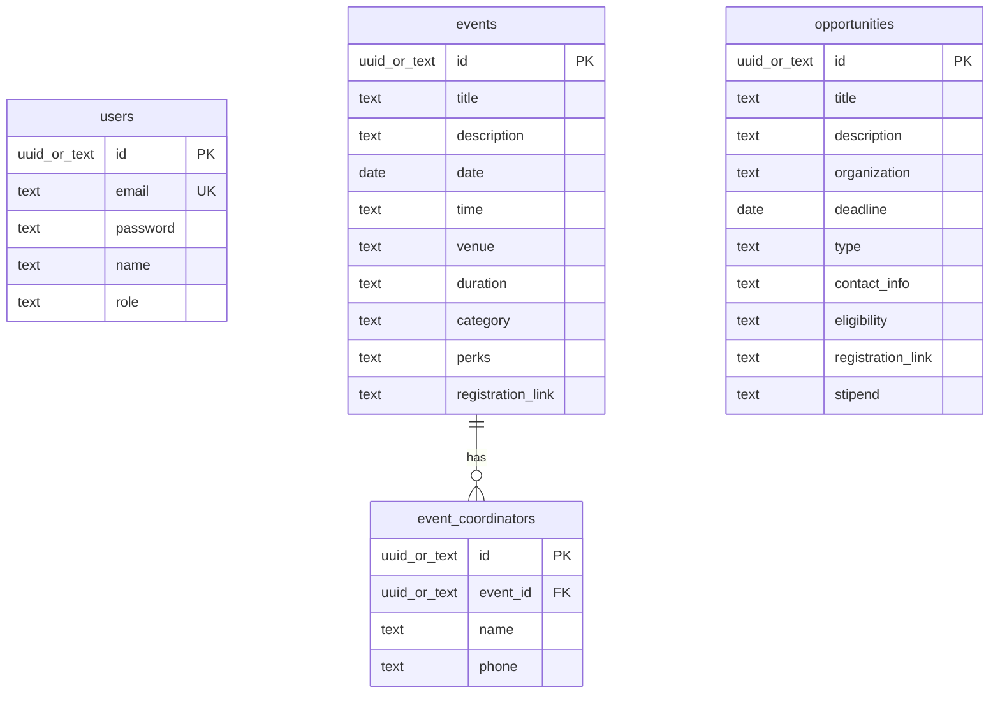

# EventSync — Backend Schema

> **Note:** Schema is inferred from application code and Supabase usage. Migration SQL files are **not** committed in this repository.

## Database Overview

| Property | Value |
|----------|-------|
| Provider | Supabase (PostgreSQL) |
| Access from app | `@supabase/supabase-js` with anon key |
| Tables in use | `users`, `events`, `event_coordinators`, `opportunities` |
| ORM | None — direct Supabase client queries |
| Migrations in repo | Project not Supported |

## ER Diagram



## Tables

### `users`

Used by signup and admin login.

| Column | Type (inferred) | Required | Notes |
|--------|-----------------|----------|-------|
| `id` | uuid/text | Yes | Primary key |
| `email` | text | Yes | Unique; normalized to lowercase on write |
| `password` | text | Yes on signup | Login also checks `password_hash`, `passwd` if present |
| `name` | text | Yes on signup | Login display may use `full_name` or `username` fallback |
| `role` | text | Expected for login | `admin` or `superadmin` required for dashboard access |

**Signup insert shape:** `{ name, email, password }` — role assignment not handled in app code.

### `events`

| Column | Type (inferred) | Required | Notes |
|--------|-----------------|----------|-------|
| `id` | uuid/text | Yes | PK; generated by database |
| `title` | text | Yes | Validated on admin create/update |
| `description` | text | No | |
| `date` | date/text | Yes | Validated on admin create/update |
| `time` | text | No | |
| `venue` | text | No | |
| `duration` | text | No | |
| `category` | text | No | e.g. Technical, Academic, Cultural |
| `perks` | text | No | Stored as comma-separated string; API normalizes to array on read |
| `registration_link` | text | No | External registration URL |

**Default ordering:** `date ASC` on public list API.

### `event_coordinators`

| Column | Type (inferred) | Required | Notes |
|--------|-----------------|----------|-------|
| `id` | uuid/text | Yes | PK |
| `event_id` | uuid/text | Yes | FK → `events.id` |
| `name` | text | Yes | Rows without name are skipped |
| `phone` | text | No | |

**Lifecycle:** Replaced entirely on event update (delete by `event_id`, then insert new rows).

### `opportunities`

| Column | Type (inferred) | Required | Notes |
|--------|-----------------|----------|-------|
| `id` | uuid/text | Yes | PK |
| `title` | text | Yes | |
| `description` | text | No | |
| `organization` | text | No | |
| `deadline` | date/text | No | |
| `type` | text | No | Internship, Research, Leadership, Volunteer, Other |
| `contact_info` | text | Yes | Email, phone, or URL string |
| `eligibility` | text | No | |
| `registration_link` | text | No | External apply URL |
| `stipend` | text | No | Displayed on detail page if present in DB |

**Default ordering:** `deadline ASC` on public list API.

## Relationships

| Parent | Child | Cardinality | Enforced by |
|--------|-------|-------------|-------------|
| `events` | `event_coordinators` | 1:N | `event_coordinators.event_id` |

No foreign keys from `users` to events/opportunities. No registration/application tables exist yet.

## Constraints

| Constraint | Source | Notes |
|------------|--------|-------|
| Required admin fields | Application validation | Events: title, date. Opportunities: title, contact_info |
| Unique email | Database (inferred) | Signup handles duplicate key / `23505` |
| FK event → coordinators | Database (inferred) | Event delete may fail until coordinators removed |
| Role check | Application | Admin APIs require `admin` or `superadmin` |

Database-level CHECK constraints and NOT NULL definitions: **not documented in repository** — confirm in Supabase dashboard.

## Indexes

Project not Supported.

No index definitions are committed in the repository. Recommended operational indexes (not verified):

- `events(date)`
- `opportunities(deadline)`
- `event_coordinators(event_id)`
- `users(email)` unique

## RLS Policies

Project not Supported.

Row Level Security is not defined in the repository. The app uses the Supabase anon key from server route handlers for reads and writes. RLS configuration, if any, must be managed directly in Supabase.

## Triggers

Project not Supported.

No database triggers are defined in the repository.

## Functions

Project not Supported.

No PostgreSQL stored functions or Supabase RPC calls are used. Business logic runs in Next.js API route handlers (`lib/server/auth.ts`, `lib/server/validation.ts`, route files).

## Storage Structure

Project not Supported.

- No Supabase Storage buckets referenced.
- No image/file upload APIs.
- Event/opportunity visuals use CSS gradients and badges, not uploaded media.

## API Models

### Public read models

**`GET /api/events`**

```json
{
  "events": [
    {
      "id": "string",
      "title": "string",
      "description": "string?",
      "date": "string?",
      "time": "string?",
      "venue": "string?",
      "duration": "string?",
      "category": "string?",
      "perks": ["string"],
      "registration_link": "string?"
    }
  ]
}
```

**`GET /api/events/[id]`**

```json
{
  "event": { "...event fields, perks as array..." },
  "coordinators": [
    { "id": "string", "event_id": "string", "name": "string", "phone": "string?" }
  ]
}
```

**`GET /api/opportunities`**

```json
{
  "data": [ { "...opportunity fields..." } ]
}
```

**`GET /api/opportunities/[id]`**

```json
{
  "opportunity": { "...opportunity fields..." }
}
```

### Admin write models

**`POST /api/admin/events`**

```json
{
  "title": "string",
  "date": "string",
  "description": "string?",
  "time": "string?",
  "venue": "string?",
  "duration": "string?",
  "category": "string?",
  "perks": "string | string[]?",
  "registration_link": "string?",
  "coordinators": [{ "name": "string", "phone": "string?" }]
}
```

**`PUT /api/admin/events/[id]`** — same body shape as create.

**`POST /api/admin/opportunities`**

```json
{
  "title": "string",
  "contact_info": "string",
  "description": "string?",
  "organization": "string?",
  "deadline": "string?",
  "type": "string?",
  "eligibility": "string?",
  "registration_link": "string?"
}
```

**`PUT /api/admin/opportunities/[id]`** — same body shape as create.

### Auth models

**`POST /api/auth/login`**

```json
{ "email": "string", "password": "string" }
```

Response: `{ "session": AdminSession }` + Set-Cookie.

**`POST /api/auth/signup`**

```json
{
  "name": "string",
  "email": "string",
  "password": "string",
  "confirmPassword": "string"
}
```

**`AdminSession`**

```json
{
  "id": "string | number",
  "email": "string",
  "name": "string | null",
  "role": "string",
  "loginAt": "ISO-8601 string",
  "expiresAt": "ISO-8601 string"
}
```

### Error model

```json
{ "error": "string", "...optional fields" }
```

## Audit Strategy

Project not Supported.

- No `created_at` / `updated_at` / `created_by` fields referenced in application code.
- No audit log table or change-history tracking.
- No soft-delete columns (`deleted_at`).
